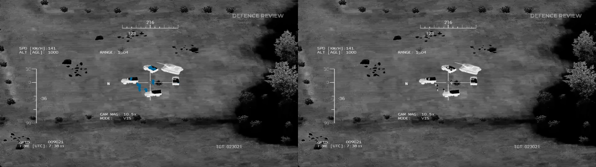
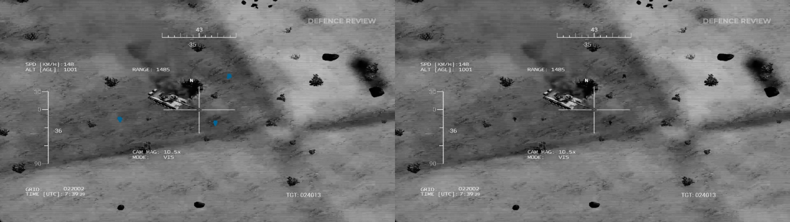
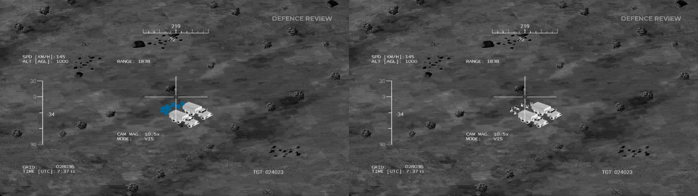
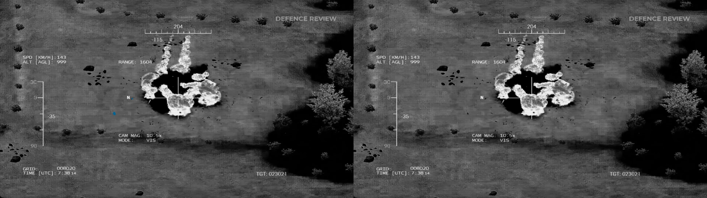

# Question
Can we segmentation humans in video brodcast that coming from unarmed air vehicle to help operator who trying to detect humans by monitoring.

# Setup
- Custom UNet architecture is used.
- Pytorch framework is used.
- Used language is python.
- The dataset collected from a geme named Arma 3.
- There are binary masks of humans in dataset.
- Algorithms tested with RTX 3070 and i5-11600k.
- Cvat is used for data annotation.

# Observation
- **Humans successfully can be segmentated.**
	
    
    
- **AI having hard times to distinguish human-like objects like bushes**
    
